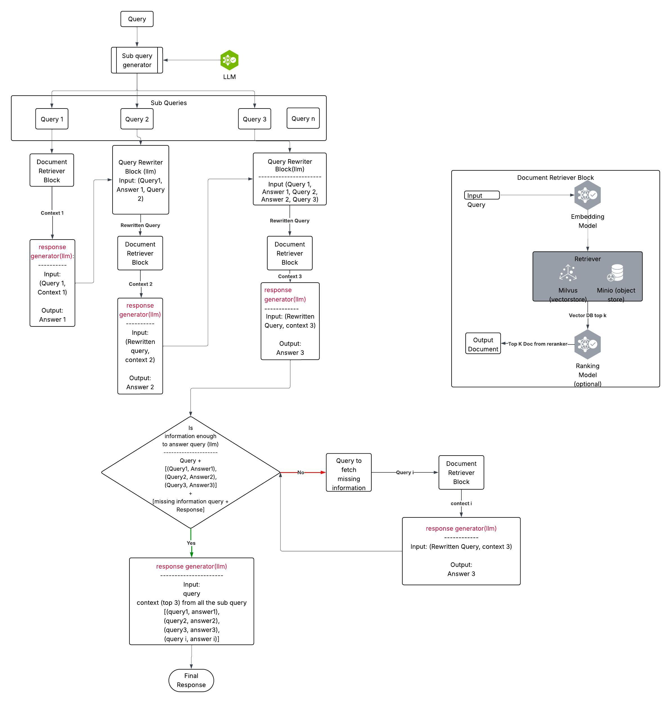

# Query Decomposition in NVIDIA RAG

## Overview

Query decomposition is an advanced RAG (Retrieval-Augmented Generation) technique that breaks down complex, multi-faceted queries into simpler, focused subqueries. Each subquery is processed independently to gather comprehensive context, which is then synthesized into a final comprehensive response.

## ⚙️ Configuration Options
You can enable query decomposition in RAG pipeline by exporting following environment variable
### Environment Variables
```bash
export ENABLE_QUERY_DECOMPOSITION=true
export MAX_RECURSION_DEPTH=3
```

### Key Benefits
- **Better Context Coverage**: Captures multiple aspects of complex queries
- **Iterative Refinement**: Follows up with additional questions based on initial findings
- **Multi-perspective Analysis**: Approaches queries from different angles

### Core Components
- **Subquery Generation**: LLM-powered breakdown of complex queries
- **Iterative Processing**: Multi-round refinement with follow-up questions
- **Response Synthesis**: Combines insights from all subqueries

## When to Use Query Decomposition

Query decomposition is especially valuable for multi-hop or complex queries that involve multiple steps or aspects. By breaking down a complex question into smaller, focused subqueries, the system can generate intermediate answers for each part. These intermediate responses are then combined to produce a comprehensive and accurate final answer.

### Example: Complex Multihop Query
```
"If my future wife has the same first name as the 15th first lady of the United States' mother
and her surname is the same as the second assassinated president's mother's maiden name,
what is my future wife's name?"

// This query requires multiple interconnected steps:
// 1. Identify the 15th first lady of the United States
// 2. Find the 15th first lady's mother's first name
// 3. Identify the second assassinated president
// 4. Find that president's mother's maiden name
// 5. Combine the two names to form the final answer
```

### ❌ When NOT to Use Query Decomposition

#### 1. **Simple Factual Questions**
```
"What is the capital of France?" 
// Simple lookup, no decomposition needed
```

#### 2. **Single-concept Queries**
```
"Define machine learning"
// Direct definition, no sub-aspects needed
```

#### 3. **Time-sensitive Queries**
```
"What's the current stock price of NVIDIA?"
// Real-time data, decomposition adds latency
```

#### 4. **Highly Specific Technical Questions**
```
"What's the syntax for creating a Python dictionary?"
// Specific syntax, no multiple perspectives needed
```

## How Query Decomposition Works
To visualize how query decomposition works, see the diagram below:



**Figure:** *Query Decomposition Flow — The system breaks down a complex query into subqueries, processes each iteratively, and synthesizes a comprehensive answer.*

---

### Core Algorithm

1. **Subquery Generation**: Break down into focused questions
2. **Iterative Processing**: For each recursion depth:
   - Process each subquery independently
   - Rewrite queries with accumulated context
   - Retrieve and rank relevant documents
   - Generate focused answers
   - Collect contexts for synthesis
3. **Follow-up Generation**: Create follow-up questions for information missing from original query
4. **Termination Check**: Stop if no follow-up needed or max depth reached
5. **Final Synthesis**: Generate comprehensive response from all contexts and conversation